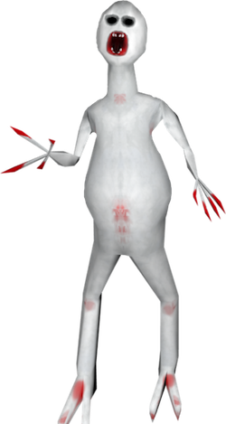

# Shamans

## Structure

- `assets/` source files for game data (PSDs, blender, etc).
- `data/` built game data such as models, textures, etc.
- `docs/` a postmordem about the project.
- `source/engine/` portable game and engine code.
- `source/platform/` API or platform-specific modules.
- `platform/` platform specific code, assets, and project files.
- `tools/` asset creation tools such as scripts for Blender.

## Game Data

To run the game, you will need to acquire the game data.

# License

The code is licensed under [GPL](LICENSE).
