Shamans History
-------------------------

This article is a history of how I made Shamans and some of the lessons I learned in development. Shamans is currently in testing. The source code will be released on my Github, but the game data is not open source (similar to id tech). 

### Engines vs Games

Shamans is not my first 3D project. I have been involved in 3D graphics profesionally, and game development as a hobby for more than 5 years. But, in my attempts to make games in the past I always tried to craft the perfect game engine which I could then use to create a game. Each was a cleanly designed object framework, with enough generality to anticipate "any kind of game" I might want to make. Below are some screenshots from these early projects:

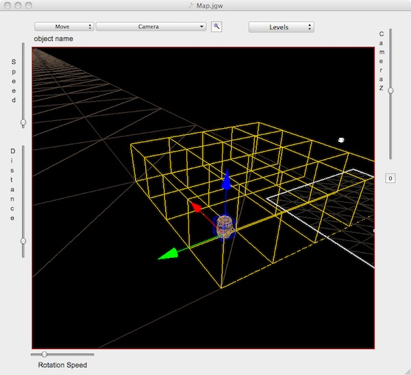

](img/galaxy_forge_lg.jpg)

[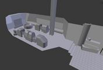](img/space_ship_lg.jpg)

This is a common problem for programmers who just want to tinker with tech. In software systems this is known as the [Turing Tarpit](https://en.wikipedia.org/wiki/Turing_tarpit) problem. Although making engines like this is a fun excercise, it doesn't lead to many finished games. Solving general problems is very difficult in the first place, but games are really design problems, and design is about choices. Without a particular game in mind, you cannot make any choices, or weigh any tradeoffs, or make any ontological commitments.
    
 A good example of this is Quake. In the Quake engine has two kinds of objects, entities (dynamic moving objects) and the game world (static world scenery). The fact that the game world is static allows it to be rendered very quickly, with detailed lighting and effects, which the entities don't have. This choice works very well for an indoor, first person shooter, but would be hopeless for a game that required destructible enviornments. Without knowing the kind of game they wanted, they would never have been able to make that choice.

After learning great technical lessons from making engines I realized the most effective way to make a game is to build the engine around the game, instead of the other way around. Shamnas is a result of this philosophy. Every line of code I wrote was to get to the next game feature. This choice was reinforced by choosing C rather than C++. C++ encourages you to write everything as a generic abstraction. C allows you to write polymorphic abstractions when you need, but the default is writing concrete code for specific problems.

### Early Game

The original concept for Shamans looked very different from the final product. The game began as a 3D point and click adventure, in which players would experience a short story set within a castle. The technology which I built for this adventure concept lended itself to the design of the final game. Levels are built from "chunks" of 3D scenery with detailed precalculated lightmapping. As the camera moves around chunks offscreen are hidden from rendering. The gameplay for characters takes place upon an invisible navigation mesh which represents the playable area. This allows the game to render beautiful worlds that exist independant of the actual gameplay.

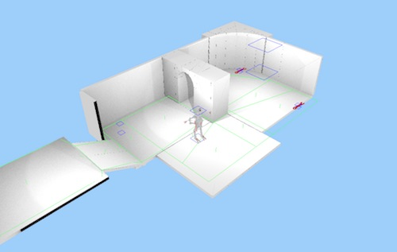

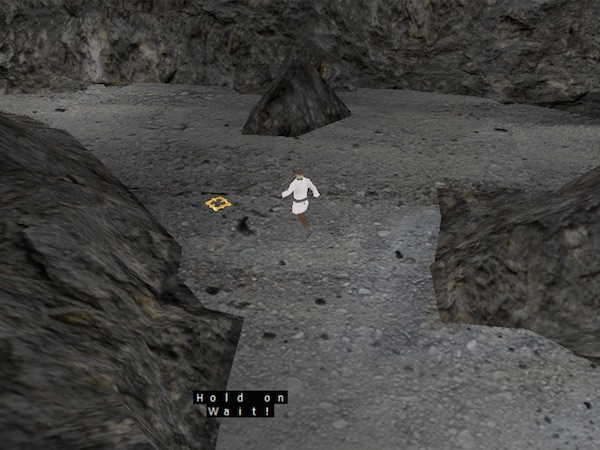

Unfortuntaly, creating detailed 3D worlds and scripting story events turned out to be a too large of project for a one person team. After experimenting with several enviornments, I made the decision to design a game which would require less art content. The turn-based design ended up fitting well with the technology already built, and allowed for a slow paced game that is better suited for tablet play, and was less demanding in terms of art.

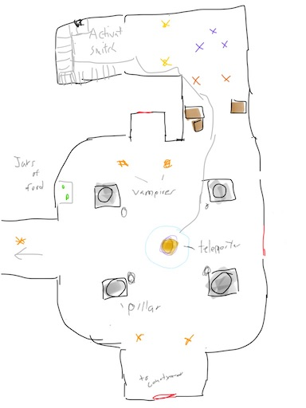

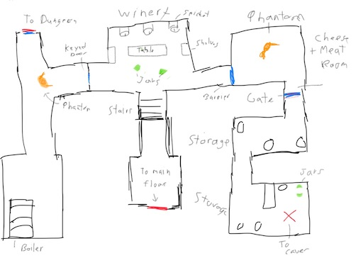

### Levels

Creating the art for the levels was still an enourmous amount of work for one programmer. After several attempts of modeling levels from hand I realized I had to use a more effecient approach. The task was mitigated by constructing a set of modular art pieces which are put together to form the levels. [(A common practice in the industry.)](http://www.gamasutra.com/view/feature/130885/creating_modular_game_art_for_fast_.php) A collection of carefully crafted pieces, such as walls, floors, etc, are modeled in a grid system, and snap together like a lego kit. The modular approach also uses memory very effeciently. The entire kit for the game shares a single 2048x2048 texture created from photographs and several hand painted pieces. (All the source photos were taken by me.)

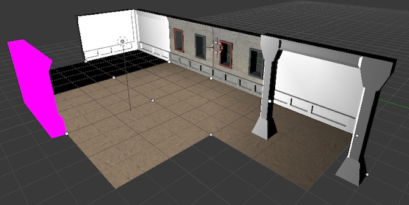

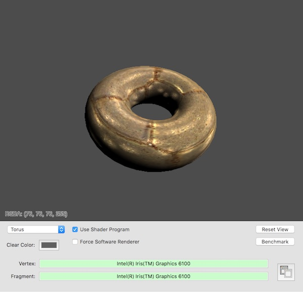

### Characters & Animation

I started on the character models early in the game. Creating the characters was one of the most artistically challenging part of the game. Although a profesional artist will scoff at my work, I was able to exceed my own personal expectations, and get the quality and look I wanted. The game contains 5 unique characters, each with their own model, skeleton, texture and several animations. Each character was designed to have a similar "look and feel" so they cohere together in the same world.

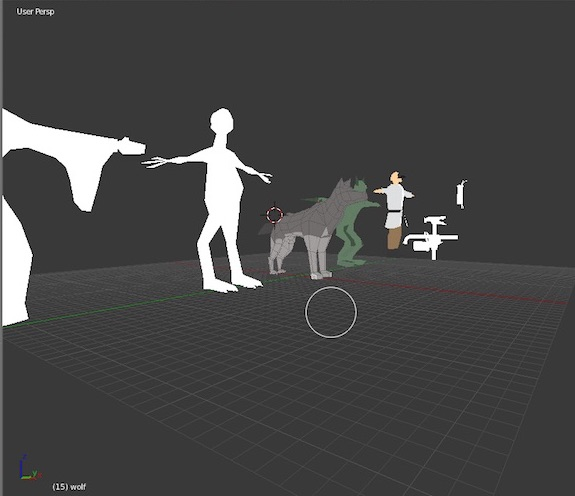
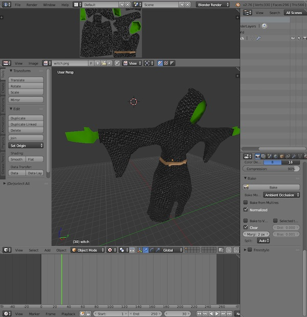
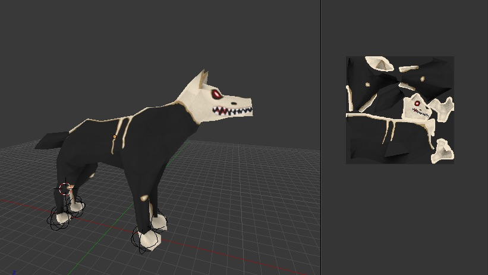
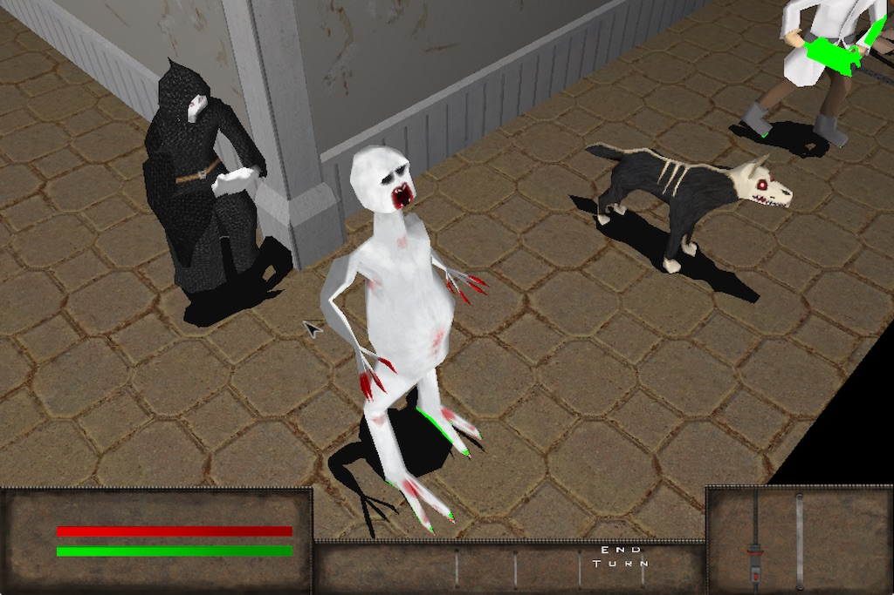

All of the textures for the characters and items are hand painted. About half of the animations were created by hand, and the other half were created from reference footage. My sister (who is a dancer) helped me out by acting out many of the animation sequences. I used the footage of her acting out movements for rotoscoping.

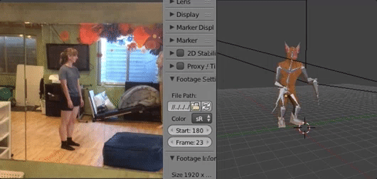

The skeletal animation format began as a modified [MD5 file format](http://tfc.duke.free.fr/coding/md5-specs-en.html), but evolved to an entirely unique format. Like MD5, skeletons are stored with mesh information in a "skel mesh" file. Animation sequences store rotation information as arrays of quaternions, and are stored in separate file from the mesh. 

Initially the skeletal animation process was written in C for the CPU, but after initial tests on the iPad, the process for transforming the skin by the skeleton performed very poorly. But, the inherently parallel problem was a perfect fit for the GPU. The skin transformation is now calculated in a vertex shader.

### Tuning & Optimization

The ability to measure performance and make adjustments to fit hardwre, such as the GPU skinning process, is one of the key advantage of focusing on a game rather than an engine. With a game engine I couldn't confidently make such adjustments without rectifying how it would affect each platform and potential game genre. 

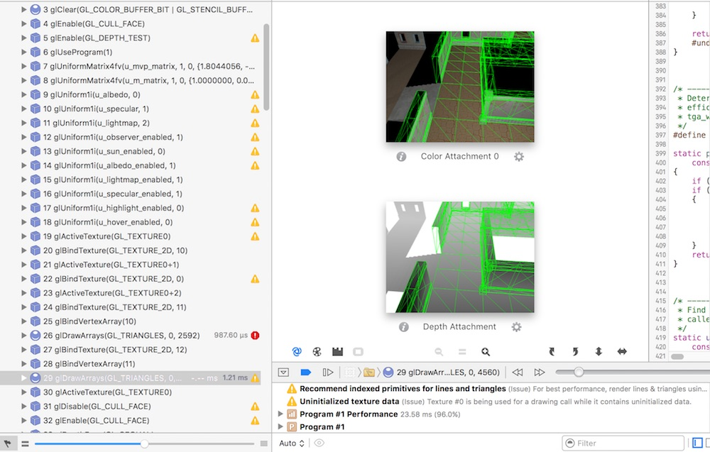

Tailoring the program to the hardware is especially important for mobile devices. From projects in the past I became familiar with the strengths and weaknesses of PowerVR SGX and Apple A7+ GPUs, and was able to maximize the hardwares capabilities. The game is very efficient in its usage of draw calls, data formats, and pixel shader complexity. Every iPad since the iPad 2 should run at 60fps. 

I have learned that OpenGL does not meanswrite once run anywhere. Writing correct syntax and processes are the easiest part of graphics programming. 3D graphics have to be written and adapted for dissimilar graphics cards.

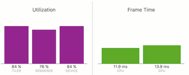

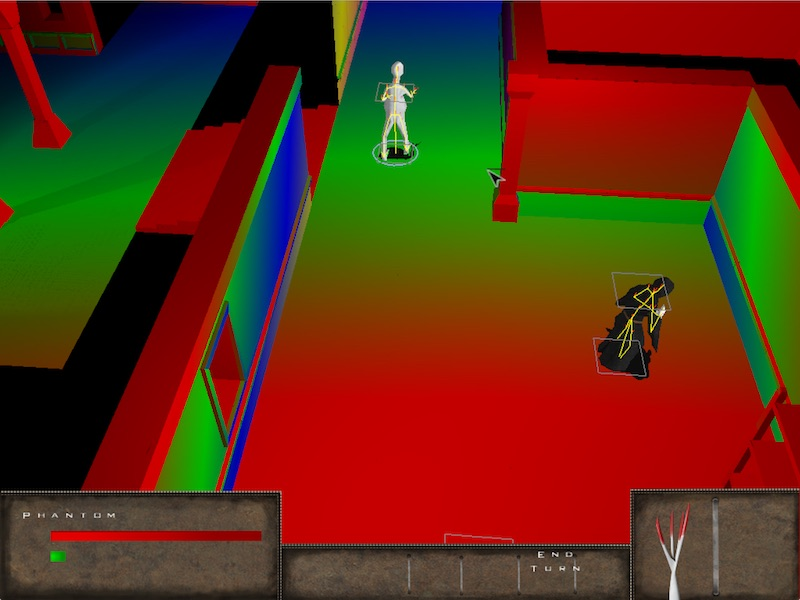

### Special Features

Early versions of the game used the fixed-function pipeline of legacy OpenGL for simplicity. One challenge that pushed me to finally move to programmable pipeline was the unit visiblity, or "fog of war" effect. I first attempted to render spheres into the stencil buffer which would be used as the visibility volume, but unfortuantly I could not create the effect I wanted.

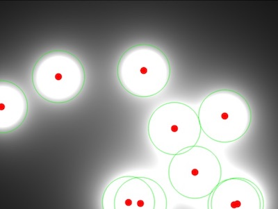

The particle system is "stateless". Each effect is defined by a pure function of time, rather than iterative algorithms. These functions are built from primitive functions such as sin, cos, lerp, etc. This allows each particle to run entirely in parallel, and for the system to  run on the GPU. The image below is a function which I used for noise. Although it is not random, sampling at various points gives the appearance of randomness.

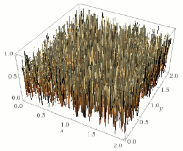

The menu, overworld, and many UI images were created from offline renders from Blender. Offline rendering was a process I found very enjoyable and creative. Creating 3D art for the game is more of a techincal process; there are hard constraints, such as how the model is formatted, how the normals blend, the number of triangles, etc,  which require precise and careful work. Creating prerendered images allows almost total freedom in how art is created which was a nice break.

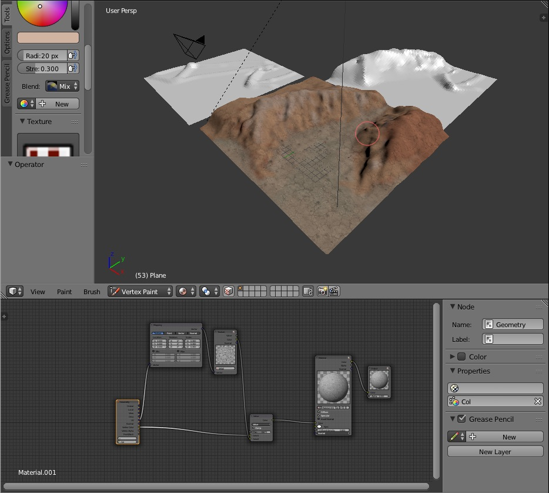

### Conclusion

The amount of work that goes into creating a 3D video game is massive. I strongly encourage hobby developers to pick as focused of a project as possible. Shamans is only a simple tablet game, with a few hours of content and several characters. It doesn't come close to the size and quality of big budget titles and sticks to familiar gameplay. However, I am still excited to finally release my own game, even if it is a simple one. 

I hope you enjoy it! The final screenshots below are a timeline of the games progression from start to finish.

If you have any feedback, requests for future platform, or questions about game development, please contact me.

## Programming References

* [3D Kingdoms](http://www.3dkingdoms.com/)
* [Fabien Sanglard](http://fabiensanglard.net/)
* [FlipCode](http://flipcode.com/)
* [Ken Silverman](http://advsys.net/ken/)
* [Paul's Projects](http://www.paulsprojects.net/)
* [Sean Barrett](http://nothings.org/)
* [Learn OpenGL](http://learnopengl.com/)
* [Learning Modern 3D Graphics Programming](https://paroj.github.io/gltut/)
* [NeHe](http://nehe.gamedev.net/)
* [Ramblings in Realtime](http://www.bluesnews.com/abrash/)
* [Unreal Engine 3 - Lightmass](http://udn.epicgames.com/Three/Lightmass.html)
* [Valve's Developer Site](http://developer.valvesoftware.com/)
* [Video Tutorials Rock](http://www.videotutorialsrock.com/)
* [What is An Entity System](http://www.richardlord.net/blog/ecs/what-is-an-entity-framework.html)

## Art References

* [Brief Considerations About Materials](http://www.manufato.com/?p=902)
* [Color Temperature](https://en.wikipedia.org/wiki/Color_temperature)
* [Colour Temperature](http://www.techmind.org/colour/coltemp.html)
* [Intermediate Lighting - Lighting Psychology](https://developer.valvesoftware.com/wiki/Intermediate_Lighting#Lighting_psychology)
* [Creating Models in Quake 4](https://web.archive.org/web/20160321000657/https://www.iddevnet.com/quake4/ArtReference_CreatingModels)
* [Creating Modular Environments in UDK](http://web.archive.org/web/20130814040659/http://www.thiagoklafke.com/modularenvironments.html)
* [Creating Pixel Art](http://pixeljoint.com/forum/forum_posts.asp?TID=11299)
* [Skyrim's Modular Level Design](http://blog.joelburgess.com/2013/04/skyrims-modular-level-design-gdc-2013.html)
* [So You Want To Be A Pixel Artist?](http://mirror.motherhamster.org/tsugumo/default.html)
* [Ten Top Tips of Texturing](https://web.archive.org/web/20120512014055/http://www.cgsociety.org/index.php/CGSFeatures/CGSFeatureSpecial/the_top_ten_tips_of_texturing)
* [The Art of Low Polygons](http://web.archive.org/web/20081222192247/http://www.alice.org/bvw03/TAweb/LowPoly/)
* [Texture Painting](https://web.archive.org/web/20151128154844/http://www.michaeldashow.com/tips_texturepainting.html)

